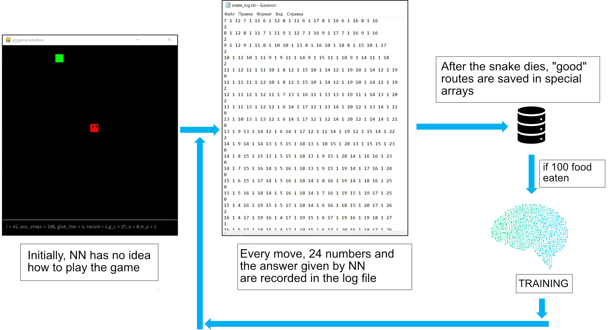
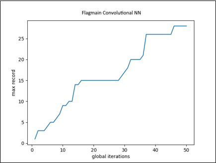

# TensorSnake

## Getting Started


**Install dependency:**

To install all required modules, just enter the repo folder and type:
```bash
py -m pip install -r requirement.txt
```
This will install Tensorflow, numpy and PyGame modules

**Check config file:**

You can change various values of the program with config.txt file:
```bash
model_name = example_model  # name of training model  
rewrite_model = False  # True = create (or rewrite existing) model with {model_name} ; False = load model {model_name}
GPU_usage = False  # True = use GPU for training (only if specific drivers are installed) ; False = use CPU instead
snake_color = (255, 255, 0)  # tuple with color of the snake
snack_color = (255, 0, 0)  # tuple with color of snack
possible_steps_const = 200  # max possible steps until snake death 
learning_rate = 100  # if snake ate more snacks than {learning_rate} --> training starts with all saved "good" routes (route led snake to snack)
epochs = 500  # how many fitting iterations will NN go through
iterations_limit = 35  # limit on a certain value of training iterations (you can see how many training iterations have already been performed in the meta file of the model). Set -1 to disable
```
In the initial config file, {model_name} = "example_model" and {rewrite_model} = False, so the example_model model will be loaded and the program will work with it

If you want create your own model, just change {model_name} on whatever you want and change {rewrite_model} to True - the program will create {model_name} directory and your model with meta file will be placed there.

Change {GPU_usage} to True if you want to use your GPU for training. This works only if CUDA and CuDNN drivers are installed  [INSTALLATION TUTORIAL](https://www.youtube.com/watch?v=hHWkvEcDBO0)

You can change color of snake and snack in (r, g, b) form with {snake_color} and {snack_color}

If the snake has walked {possible_steps_const} steps and did not take snack, it dies. 
This limitation is necessary because the snake often enters "cycles" from which it cannot get out

{learning_rate} is a value that defines how much snacks the snake must eat in order for NN learning to begin. For example, if {learning_rate} = 1000, snake must eat >= 1000 snacks in order to start learning all stored "good" routes (routes led snake to snack). In theory, the higher this value, the better NN will learn on a particular iteration, but I actually didn't notice much difference between {learning_rate} = 100 and {learning_rate} = 1000

Model will train with {epochs} amount of iterations. Actually, {epochs} = 500 is enough for NN to train with pretty good "loss"

To train the model to certain value of training iterations {iterations_limit} is used. This value must be > than already performed training iterations (check the model meta file). Set to -1 to disable


**Meta file structure:**

Every model has its own meta.txt file


Each column has 3 variables:
+ Training iteration number
+ Snake record - the snake's record at the time of this iteration
+ Snake middle_point - average number of snacks eaten per round at the time of this iteration

Each training iteration, this file is supplemented with new values

You can visualize the whole training process of the model with this data

When you load the model, the training process continues with last 3 values


**Run:**

To run the program, type:
```bash
py Snake.py
```
This will launch the training programm with values from config.txt and {model_name} model


## How it works

**Visualization:**

GUI is based on a tutorial from the [techwithtim.net](https://www.techwithtim.net/tutorials/game-development-with-python/snake-pygame/)


The main part of the window is occupied by a snake controlled by Neural Network. Snake makes moves to eat the snack

The bottom of the window contains some runtime info about game:
+ i – amount of eaten snacks during current training iteration
+ pos_steps – how much moves snake can make until death ( {possible_steps_const} is the limit )
+ glob_iter – current training iteration
+ record – max number of snacks ever eaten in one round
+ g_c – amount of rounds during current training iteration
+ p – number of snacks eaten in current round
+ m_p - average number of snacks eaten per round at the time of this iteration

**Neural Network:**

Each turn the distances to food, walls and the “snake's” tail are collected from 8 blocks around the snake's head. After collecting data, 24 numbers are obtained, which are the input of Neural Network. The output data is a number defines the direction of snake’s movement


The Neural Network itself contains Convolutional + Dense layers with “Adam” optimizer


I tried various of models, and this one is the best in my practice

**Training process:**

Initially, Neural Network has no idea about game rules, so the snake can only accidentally stumble upon a snack. Because of it, the first iteration (first {learning_rate} snacks) is very long-lasting (about 30-40 minutes). 

Every move, 24 numbers and the answer given by NN are recorded in the log file. In the end of the round (after snake dies), "good" routes are saved in special arrays (“good“ routes led snake to snack). After {learning_rate} snacks eaten, training is performed on the Neural Network with {epochs} epochs.

This process continues while training iterations < {iterations_limit}, or even goes forever, if {iterations_limit} = -1



**Statistics:**
These graphs are based on middle results of some models after 50 training iterations. Middle points graph has about 11 points on Y-axis at the top ; records graph has about 30 points on Y-axis at the top




May be, it’s possible to achieve better results if change model a little bit, or use another values for constants in config.txt


